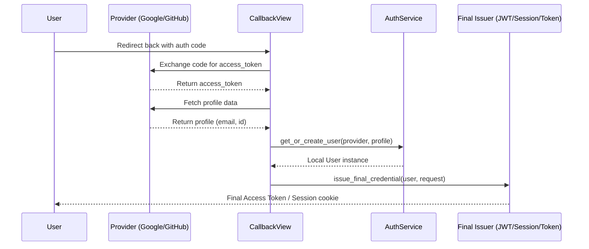

# Authentication Module Architecture

This document describes the design philosophy and architectural constraints of the `authentication` module.

---

## 1. Core vs. Auth Methods

To support modularity and prevent dependency creep, the module is strictly divided into two scopes:

```mermaid
graph TD
    subgraph Core Module (No DRF / JWT deps)
        AuthService --> LoginAttempt
        AuthService --> LoginThrottle
        PasswordService --> tokens[Stateless Token Generators]
        EmailVerificationService --> tokens
    end

    subgraph Auth Methods (Opt-in)
        session[session/] --> AuthService
        token[token/] --> AuthService
        jwt[jwt/] --> AuthService
        oauth2[oauth2/] --> AuthService
    end
```

### Core (`core/`)
Contains all business logic, models, and security throttling that are **independent** of how the user maintains their login state (session, token, etc.).
- **Lockout & Throttling**: Brute-force protection built on top of `LoginAttempt` logs.
- **Verification & Recovery**: Email validation and password reset flows using stateless token generators.
- **Timing Mitigation**: Password verification is executed even when matching accounts are absent, preventing user enumeration.
- **Signals**: Hooks (like `login_credentials_verified`) allowing plug-and-play extensions like multi-factor authentication (MFA/2FA) to interrupt flow without coupling.
- **Dependency Rule**: `core` must have **zero** import-time dependency on `rest_framework`, `rest_framework_simplejwt`, or OAuth client libraries. It operates entirely on standard Django.

### Auth Methods (`auth_methods/`)
Contains opt-in login adapters. Consuming projects include only the method(s) they need in their URLconf.
- **Session**: Stateful Django database sessions.
- **Token**: Standard Django REST Framework (DRF) tokens.
- **JWT**: JSON Web Tokens using `djangorestframework-simplejwt`.
- **OAuth2**: Handles redirect flows and code exchanges.

No authentication subpackage may import another authentication subpackage (e.g., `token` never imports `jwt`).

---

## 2. OAuth2 Hand-off Pattern

The `oauth2` subpackage contains no dedicated credential issuance schema. It does not generate OAuth tokens for client consumption. Instead, it performs a **hand-off** to one of the other three active authentication methods.



### Why this design?
1. **Decoupling**: OAuth2 is an identity validation method, not a credential token framework. Separating validation from issuance allows single-sign-on (SSO) to work regardless of client architecture (SPAs, mobile apps, or server-rendered pages).
2. **Reusability**: By delegating to configured credential providers (session, token, or JWT), OAuth2 does not repeat the token storage, cycling, or revocation logic already defined in those subpackages.
3. **Flexibility**: Clients can declare a default credential issuer (e.g. `OAUTH2_DEFAULT_ISSUER = "jwt"`) or request a specific type dynamically during the flow (e.g., `?issue=token` from a mobile app vs. standard session redirect for web).
