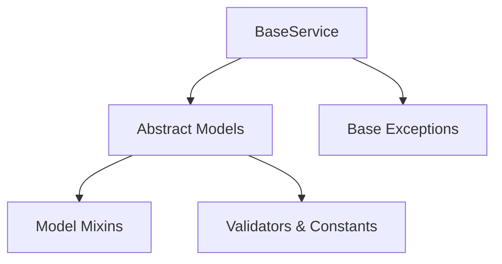

# Architecture & Design Decisions

This document outlines the architectural decisions and design patterns utilized in the `common` module of the **FCO Django Kit**.

## Design Philosophy

The `common` module serves as the foundation for all modules in this toolkit. It is designed around several key concepts:

1. **Explicit Layers over Implicit Magic**: Clean separation of models, mixins, service layers, and validation rules.
2. **Reusability & DRY**: Generic base structures (e.g., `BaseService`, reusable validators, abstract models) are defined once so subsequent modules have zero boilerplate.
3. **Decoupled Architecture**: Minimize direct dependencies between apps. Instead, utilize Django settings (like `settings.AUTH_USER_MODEL`) and standardized custom exceptions.
4. **Type Safety**: Type hints are heavily utilized to enable reliable autocomplete, static analysis, and type checking.

---

## Component Layout

### 1. Model Mixins vs. Abstract Models
We decouple field definitions from abstract model entities.
* **Mixins** (`common/mixins/`): Contain fields and behavior that can be mixed into any standard Django model class (e.g., `SoftDeleteMixin`).
* **Abstract Models** (`common/models/`): Provide concrete abstract classes that implement the mixins directly. Callers can inherit from these models (e.g. `SoftDeleteModel`) to inherit complete behavior immediately.

### 2. Base Exceptions
We provide a module-owned exception hierarchy (`FcoKitException`). Other modules can inherit from these rather than exposing raw Django/ORM internal exceptions (like `ValidationError` or `DoesNotExist`) directly to views.

### 3. Base Service Layer
The business logic should live inside services, not models. `BaseService` provides:
* Standardized logger setup.
* Helper methods for creating/updating instances (`create_instance`, `update_instance`) that automatically perform validation checking.
* Wrap ORM validations inside `ValidationException`.

---

## Key Design Patterns

### Soft Delete Strategy
To support soft-deletion, we use a custom QuerySet and Manager structure:
1. `SoftDeleteQuerySet`: Overrides `.delete()` to perform an `.update(is_deleted=True, deleted_at=now)` instead of hard deleting, and exposes `active()`, `deleted()`, and `hard_delete()` methods.
2. `SoftDeleteManager`: Filters out soft-deleted records by default.
3. `SoftDeleteAllManager`: Exposes all records, including soft-deleted ones. This manager is registered as `all_objects` on `SoftDeleteModel` and marked as `base_manager_name = 'all_objects'`. This ensures that Django's internal relation resolver (e.g., ForeignKey lookups) can still find deleted records.
